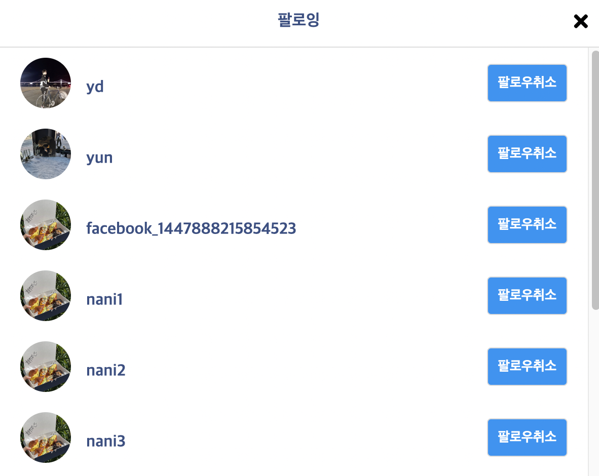

# 포토그램 - 인스타그램 클론 코딩

# Demo
[]()

# 개발 목표 & 개발기간
- 2024/01/10 - 2024/01/30

- 인스타그램 기능을 참고한 클론 웹 사이트 제작(프론트&백엔드 프로젝트)
- 회원가입 및 로그인 기능
- 프로필 수정 기능
- 게시글 작성(사진 첨부, 댓글 작성) 기능
- 게시글 좋아요 및 인기 글 게시판 
- 팔로워 팔로잉 관리 기능

# 사용 기술
- IDE : Eclipse, MySQL Workbench, Postman
- Server : Apache Tomcat 9.0
- lang : Java(JDK 11), JavaScript, HTML/CSS
- DB : MySQL 8.0.33
- 라이브러리 : JQuery, JSTL, Lombok, qlrm, WebSocket, Security Taglibs


# Advanced Feature
- 로그인 및 회원가입, 회원정보 수정

</img></img></img>

- Facebook 소셜 로그인

</img>

- 프로필 정보, 게시글 모달 창

</img></img>

- 팔로잉 기능

</img>


# 개선 사항
- 메인 페이지에서도 유저 이름 클릭 시 프로필페이지로 이동 가능하게 수정(24/01/29 수정완)
- 프로필페이지에서 게시글 클릭시 모달 창으로 내용 보여주기(24/02/01 수정완)
- DM기능 구현하기


## 의존성

- Spring Boot DevTools
- Lombok
- Spring Data JPA
- MySQL DB Driver
- Spring Security
- Spring Web
- oauth2-client

```xml
<!-- 시큐리티 태그 라이브러리 -->
<dependency>
	<groupId>org.springframework.security</groupId>
	<artifactId>spring-security-taglibs</artifactId>
</dependency>

<!-- JSP 템플릿 엔진 -->
<dependency>
	<groupId>org.apache.tomcat</groupId>
	<artifactId>tomcat-jasper</artifactId>
	<version>9.0.43</version>
</dependency>

<!-- JSTL -->
<dependency>
	<groupId>javax.servlet</groupId>
	<artifactId>jstl</artifactId>
</dependency>
```

## 데이터베이스

```sql
create user 'nani'@'%' identified by 'nani1234';
GRANT ALL PRIVILEGES ON *.* TO 'nani'@'%';
create database insta;
```

## yml 설정

```yml
server:
  port: 8080
  servlet:
    context-path: /
    encoding:
      charset: utf-8
      enabled: true
    
spring:
  mvc:
    view:
      prefix: /WEB-INF/views/
      suffix: .jsp
      
  datasource:
    driver-class-name: com.mysql.cj.jdbc.Driver
    url: jdbc:mysql://localhost:3306/insta?serverTimezone=Asia/Seoul&allowPublicKeyRetrieval=true&useSSL=false
    username: nani
    password: nani1234
    
  jpa:
    open-in-view: true
    hibernate:
      ddl-auto: update
      naming:
        physical-strategy: org.hibernate.boot.model.naming.PhysicalNamingStrategyStandardImpl
    show-sql: true
      
  servlet:
    multipart:
      enabled: true
      max-file-size: 2MB

  security:
    user:
      name: test
      password: 1234   

#file:
#  path: /Users/nani/workspace_nani/upload/
```

## 태그라이브러리

```jsp
<%@ taglib prefix="c" uri="http://java.sun.com/jsp/jstl/core"%>
<%@ taglib prefix="sec" uri="http://www.springframework.org/security/tags"%>
```
